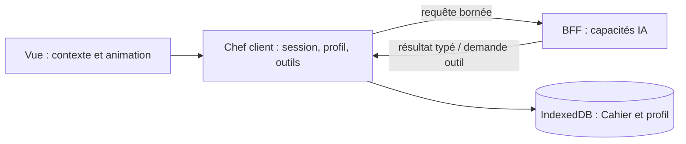

# Architecture Spine — Chef C&C

## Design Paradigm

Le client PWA orchestre l'expérience, possède les données personnelles et exécute les outils locaux. Le BFF est stateless : il applique les capacités IA et leurs contrats à des extraits temporaires minimaux.

## Invariants & Rules

### AD-1 — Client orchestrateur, BFF stateless [ADOPTED]

- **Binds:** toutes les capacités Chef.
- **Prevents:** une lecture ou une persistance serveur implicite du Cahier.
- **Rule:** le client transmet seulement le contexte utile et borné à une requête précise ; le BFF ne conserve aucun état utilisateur.

### AD-2 — Propriété locale des données utilisateur [ADOPTED]

- **Binds:** Cahier, contexte d'écran, profil Chef, préférences et apprentissages.
- **Prevents:** un second système de vérité côté BFF.
- **Rule:** ces données vivent sur l'appareil ; le BFF ne les traite qu'en extrait éphémère.

### AD-3 — Outils client-médiés [ADOPTED]

- **Binds:** recherche Cahier, extrait écran/recette/profil, écritures mémoire.
- **Prevents:** accès général du BFF à l'appareil.
- **Rule:** le BFF demande une capacité nommée et un payload minimal structuré ; le client vérifie et exécute lecture ou écriture.

### AD-4 — Mutations différenciées [ADOPTED]

- **Binds:** mémoire Chef, recettes, plans et quantités.
- **Prevents:** une mutation durable non consentie.
- **Rule:** invariant explicite mémorisable silencieusement ; inférence à faible confiance ; recette, plan ou quantité prévisualisés puis confirmés.

### AD-5 — Cycle et animation locaux [ADOPTED]

- **Binds:** conversation, annulation, rendu et six animations.
- **Prevents:** animation réseau retardée ou réponses tardives appliquées.
- **Rule:** le client déclenche les états ; le BFF peut les suggérer sémantiquement. Le client invalide les réponses tardives.

### AD-6 — Proactivité opt-in [ADOPTED]

- **Binds:** suggestions et notifications.
- **Prevents:** relances spontanées non demandées.
- **Rule:** seuls des rituels explicitement activés autorisent une notification locale ou une demande ponctuelle au BFF.

### AD-7 — Portabilité du profil Chef [ADOPTED]

- **Binds:** export/import Cahier et profil Chef.
- **Prevents:** un changement ou reset d'appareil qui restaure les recettes mais efface les apprentissages utiles.
- **Rule:** le transfert local versionné inclut les données Chef structurées nécessaires (préférences, contraintes, foyer, observations et confiance), mais exclut conversations, prompts, transcriptions, images et historique brut. L'import valide et fusionne le profil localement, sans persistance BFF.

### AD-8 — Journal local de conversations [ADOPTED]

- **Binds:** fils Assistant et fils de séance cuisine.
- **Prevents:** une conversation infinie ou un journal côté BFF.
- **Rule:** les fils sont des données utilisateur locales distinctes du profil et des recettes ; ils sont datés, contextualisables et supprimables. Nouvelle conversation clôt le fil actif, une séance cuisine ouvre son fil dédié et l'accueil ne reprend que le dernier fil pertinent au premier lot.

## Consistency Conventions

| Concern | Convention |
| --- | --- |
| Capacités | requêtes et résultats typés ; aucune action personnelle implicite |
| Mémoire | observation structurée, provenance, confiance, correction/suppression locale |
| UI | état Chef piloté localement ; mouvement réduit respecté |

## Stack

| Name | Version |
| --- | --- |
| Vue | 3 existant |
| TypeScript | existant |
| IndexedDB / Dexie | existant |
| Express BFF | existant |

## Capability → Architecture Map

| Capability / Area | Lives in | Governed by |
| --- | --- | --- |
| conversation et invocation | client Vue / session Chef | AD-1, AD-5 |
| Cahier contextualisé | outil client + service existant | AD-2, AD-3 |
| mémoire et préférences | profil local Chef | AD-2, AD-4 |
| génération et raisonnement | BFF | AD-1, AD-3 |
| notification opt-in | PWA client | AD-6 |
| export/import du profil Chef | transfert Cahier local | AD-2, AD-7 |
| continuité des échanges | journal local de conversations | AD-2, AD-8 |

## Deferred

- Schéma exact du profil Chef, du journal, leur politique de rétention/export et les payloads d'outils : à fixer dans les épics.
- Technologie et exports définitifs de l'asset animé : traités par le motion spike.
- Planification des repas et listes de courses : hors premier lot Chef.
