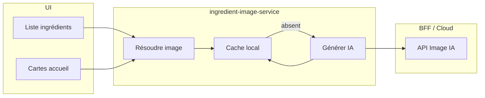

# Architecture v1

## Objectif

Définir l’architecture cible de **Cookies & Coquillettes** en PWA Vue/TypeScript avec stockage local et BFF léger pour OCR/parsing cloud.

## Vue d’ensemble

```text
[PWA Vue UI] <-> [Services métier front] <-> [IndexedDB/Dexie]
       |
       +---- HTTP ----> [BFF Node/TS] ----> [Cloud OCR + Parsing]
```

## Stack retenue

- Frontend : Vue 3 + TypeScript + Vite
- UI : PrimeVue + thème custom sobre/moderne
- PWA : `vite-plugin-pwa` (installable, manifest, share target)
- Persistance locale : IndexedDB via Dexie
- Backend léger : Node.js + TypeScript (BFF)
- Runtime : offline-first côté consultation/édition locale

## Composants

| Composant | Responsabilité | Emplacement |
|-----------|----------------|-------------|
| `app-shell` | Initialisation Vue/PWA/PrimeVue | `apps/web/src/main.ts` |
| `recipe-service` | CRUD recettes, favoris, portions | `apps/web/src/services/recipe-service.ts` |
| `import-service` | Import URL/share/screenshot/texte + appel BFF | `apps/web/src/services/import-service.ts` |
| `share-target-service` | Lecture/nettoyage des paramètres `share_target` au démarrage | `apps/web/src/services/share-target-service.ts` |
| `cooking-mode-service` | Wake Lock + fallback navigateur | `apps/web/src/services/cooking-mode-service.ts` |
| `db` | Schéma IndexedDB et accès tables | `apps/web/src/storage/db.ts` |
| `ingredient-image-service` | Résolution d'image ingrédient (cache local, génération IA), stockage | `apps/web/src/services/ingredient-image-service.ts` |
| `cooking-step-image-service` | Résolution d'image d'étape en mode cuisine (cache local, génération IA), fallback image recette | `apps/web/src/services/cooking-step-image-service.ts` |
| `step-timer-service` | Détection de durée de timer d'étape (sémantique IA + fallback) | `apps/web/src/services/step-timer-service.ts` |
| `IngredientImage` (composant Vue) | Affichage de l'icône ingrédient (fallback si absent) | `apps/web/src/components/IngredientImage.vue` |
| `import-api` | Endpoints BFF pour OCR/parsing | `apps/bff/src` |
| `domain-types` | Types métier partagés | `packages/domain/src` |

## Contrats de services (normatifs)

### Recipe service

- `createRecipe(recipe)`
- `updateRecipe(recipeId, patch)`
- `deleteRecipe(recipeId)`
- `toggleFavorite(recipeId, favorite?)`
- `listRecipes(filters?)`
- `scaleRecipe(recipeId, servings)`

Règles de contrat :
- validation à la sauvegarde (`title` + au moins un ingrédient ou une étape),
- recalcul portions depuis `quantityBase` (immuable),
- tri par défaut `updatedAt DESC`.

### Import service

- `importFromUrl(url)`
- `importFromShare(payload)`
- `importFromScreenshot(file)`
- `importFromText(text)`

Règles de contrat :
- flux direct : `parse -> create -> détail` ; image en arrière-plan si absente,
- l’UI expose un état de progression pendant l’import (analyse URL/texte, lecture image),
- pour un payload `SHARE` contenant une URL, priorité à l’extraction depuis l’URL partagée,
- la `source` d’import est persistée avec `type + capturedAt` même quand `url` est absente,
- en indisponibilité BFF/parsing, retour d’un draft fallback éditable,
- pour une source Instagram sans image locale, l’UI affiche un embed `post/reel` basé sur l’URL source.

### Cooking mode service

- `startCookingMode()`
- `stopCookingMode()`
- Le calcul de durée de session et la proposition d’ajustement de `prepTimeMin` (moyenne avec la valeur existante) sont gérés côté `App.vue` lors de l’arrêt.

### Step timer service

- `detectStepTimerDurationSeconds(stepText)`

Règles de contrat :
- le front envoie le texte brut de l'étape au BFF (`/api/step-timer-duration`) pour une interprétation sémantique de la durée à minuter,
- le BFF utilise un petit modèle IA pour extraire `durationSeconds` (ou `null` si pas de timer pertinent),
- fallback local heuristique si l'IA est indisponible ou si aucune clé n'est configurée,
- le front met en cache le résultat par texte d'étape pour limiter les appels réseau.

## Données et persistance

### IndexedDB

Tables minimales :
- `recipes`
- `images`
- `ingredientImages` (images d'ingrédients, clé = id normalisé du label)
- `cookingStepImages` (illustrations d'étapes en mode cuisine, cache local)

Index minimaux :
- `category`
- `favorite`
- `updatedAt`
- `ingredientImages.createdAt`

### Règles de persistance

1. Écriture locale immédiate après création/édition.
2. Données disponibles hors-ligne pour lecture et édition.
3. Images compressées à l’import avant stockage local.

## Import et parsing

1. Les données brutes (URL, texte, screenshot, payload de partage) sont normalisées côté front.
2. L’extraction OCR/parsing est déléguée au BFF.
3. Le BFF protège les clés cloud et renvoie un draft éditable.
4. Le front crée la recette immédiatement et affiche le détail ; l'image est traitée en arrière-plan si absente.
5. En cas d’échec partiel ou BFF indisponible, le front et/ou le BFF renvoient un draft fallback minimal.

### Stratégie de parsing (import URL pages web, Instagram, YouTube)

Ordre de priorité côté BFF :

1. **Scraper Instagram (`instagram-url-direct`)** — pour les URLs `instagram.com` (post/reel/tv), extraction de la caption + médias du post ; le texte est ensuite envoyé au parseur LLM, sinon fallback enrichi.
2. **YouTube (oEmbed + description HTML)** — pour les URLs `youtube.com` / `youtu.be`, appel oEmbed (thumbnail, titre) et fetch HTML pour `og:description` ou `ytInitialPlayerResponse` ; si la description est suffisante, envoi au parseur LLM ; sinon draft avec titre + poster.
3. **JSON-LD Schema.org** — si la page contient un bloc `application/ld+json` de type `Recipe`, extraction directe (titre, ingrédients, étapes, image, portions, temps).
4. **OpenAI** — si pas de JSON-LD ou extraction incomplète : envoi du texte brut à l’API avec un prompt structuré pour remplir les champs du formulaire.
5. **Fallback** — draft minimal éditable.

L'image est extraite via le scraper Instagram (URLs Instagram), via oEmbed/og:image (URLs YouTube), sinon via le champ `image` du JSON-LD ou la balise `og:image`. Le front télécharge l'image à la sauvegarde et la stocke dans IndexedDB. Pour les sources YouTube sans image locale, l'interface affiche un embed vidéo (ratio 16:9).

**Génération automatique** : lorsqu'aucune image n'est extraite, le BFF peut générer une image via une API IA (ex. DALL-E) à partir du titre, des ingrédients et des étapes. Style : photo de plat type Instagram, flat lay, élégant. Le front affiche un placeholder pendant la génération ; une fois l'URL reçue, l'image est téléchargée et stockée localement.

**Images des ingrédients** : le service `ingredient-image-service` résout l'image d'un ingrédient par son label normalisé. Si l'image n'existe pas en cache local, le BFF génère une image IA (prompt : ingrédient isolé unique, gros plan, fond blanc sans ombre, photoréaliste, lisible en petit format). L'image est stockée dans `ingredientImages` et mutualisée entre recettes. Format cible : petit (ex. 64×64 ou 96×96 px).

**Images des étapes (mode cuisine)** : à l'affichage d'une étape, le front tente de résoudre une illustration IA à partir du texte de l'étape (`/api/generate-cooking-step-image`). Le rendu affiche immédiatement l'image de recette en fallback, puis bascule vers l'illustration d'étape lorsqu'elle est disponible. Le résultat est mis en cache local dans `cookingStepImages`.

Flux de résolution :



Le BFF charge `.env` à la racine du projet (dotenv) pour `OPENAI_API_KEY`. L’extraction des ingrédients JSON-LD reconnaît notamment : `litre`/`litres`, `c à s`/`c. à s` (cuillère à soupe), et les unités courantes (g, ml, pincée, tranche, etc.).

## Gestion d’erreurs v1

1. Messages utilisateur explicites côté UI.
2. Logs console front et BFF pour diagnostic local.
3. Pas de plateforme externe de suivi d’erreurs en v1.

## Compatibilité et dégradation progressive

1. Wake Lock :
   - utiliser `navigator.wakeLock` si disponible,
   - fallback visuel/instructionnel sinon.
2. Share Target :
   - activer dans le manifest PWA (`share_target`) avec réception de payload URL/texte/titre,
   - support principal : Chromium (Android/desktop) avec PWA installée,
   - non supporté nativement sur Safari (iOS/macOS) ni Firefox,
   - conserver un fallback manuel universel : collage URL/texte/image + lecture presse-papiers.

## Arborescence cible

```text
apps/
  web/        # PWA Vue/TS
  bff/        # API Node/TS pour OCR/parsing
packages/
  domain/     # types et contrats partagés
docs/
```
