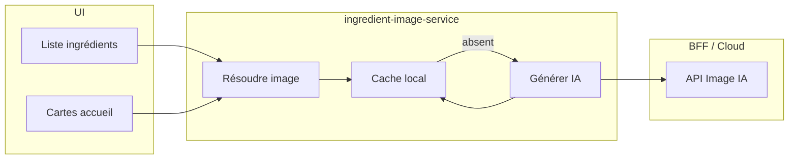

# Architecture v1

## Objectif

Définir l’architecture cible de **Cookies & Coquillettes** en PWA Vue/TypeScript avec stockage local et BFF léger pour OCR/parsing cloud.

## Vue d’ensemble

```text
[PWA Vue UI] <-> [Services métier front] <-> [IndexedDB/Dexie]
       |
       +---- HTTP ----> [BFF Node/TS] ----> [Cloud OCR + Parsing]
```

## Stack retenue

- Frontend : Vue 3 + TypeScript + Vite
- UI : PrimeVue + thème custom sobre/moderne
- PWA : `vite-plugin-pwa` (installable, manifest, share target)
- Persistance locale : IndexedDB via Dexie
- Backend léger : Node.js + TypeScript (BFF)
- Runtime : offline-first côté consultation/édition locale

## Composants

| Composant | Responsabilité | Emplacement |
|-----------|----------------|-------------|
| `app-shell` | Initialisation Vue/PWA/PrimeVue | `apps/web/src/main.ts` |
| `recipe-service` | CRUD recettes, favoris, portions | `apps/web/src/services/recipe-service.ts` |
| `recipe-book-transfer-core` | Schéma JSON v1–v3, parse, strips, remappage d’IDs à l’import (sans I/O) | `apps/web/src/services/recipe-book-transfer-core.ts` |
| `recipe-book-transfer-service` | Export / import cahier : ZIP + JSON interne (Dexie ; v3 sans blobs ; v1/v2 avec base64 possible dans le JSON à l’intérieur du zip) | `apps/web/src/services/recipe-book-transfer-service.ts` |
| `recipe-book-zip` | Compression / décompression ZIP côté client (`fflate`) | `apps/web/src/utils/recipe-book-zip.ts` |
| `recipe-book-rehydrate-after-import` | Complétion médias d’une recette issue d’archive légère (BFF cache puis IA), typiquement à la première ouverture détail | `apps/web/src/services/recipe-book-rehydrate-after-import.ts` |
| `import-service` | Import URL/share/screenshot/texte ; early-return parse F2 local (0 BFF) ; sinon appel BFF | `apps/web/src/services/import-service.ts` |
| `share-target-service` | Lecture/nettoyage des paramètres `share_target` au démarrage | `apps/web/src/services/share-target-service.ts` |
| `recipe-share-f2` | Construction et parse du texte F2 (+ CTA soft) ; reconnaissance à l’import collage / `share_target` | `apps/web/src/utils/recipe-share-f2.ts` |
| `recipe-share-card` | Génération locale canvas/PNG de l’image illustrative partage (~1080×1080 : photo + CTA visuel + logo) | `apps/web/src/utils/recipe-share-card.ts` |
| `recipe-native-share` | Orchestration Web Share (`navigator.share` / `canShare`) texte ± image illustrative PNG ; fallback presse-papiers | `apps/web/src/services/recipe-native-share.ts` |
| `recipe-detail-selection` | Résolution de la fiche DETAIL (override hors filtres), navigation post-sauvegarde, badge transitoire | `apps/web/src/utils/recipe-detail-selection.ts` |
| `cooking-mode-service` | Wake Lock + fallback navigateur | `apps/web/src/services/cooking-mode-service.ts` |
| `db` | Schéma IndexedDB et accès tables | `apps/web/src/storage/db.ts` |
| `ingredient-image-service` | Résolution d'image ingrédient (cache local, génération IA), stockage | `apps/web/src/services/ingredient-image-service.ts` |
| `cooking-step-image-service` | Résolution d'image d'étape en mode cuisine (cache local, génération IA), fallback image recette | `apps/web/src/services/cooking-step-image-service.ts` |
| `step-timer-service` | Détection de durée de timer d'étape (sémantique IA + fallback) | `apps/web/src/services/step-timer-service.ts` |
| `IngredientImage` (composant Vue) | Affichage de l'icône ingrédient (fallback si absent) | `apps/web/src/components/IngredientImage.vue` |
| `StepMentionedIngredientIcons` (composant Vue) | Icônes des ingrédients mentionnés par étape (max 3 visibles, surplus via popin PrimeVue) — détail recette et mode cuisine ; source = `ingredientIds` persistés si non vides, sinon matching tokens | `apps/web/src/components/StepMentionedIngredientIcons.vue` |
| `import-api` | Endpoints BFF pour OCR/parsing | `apps/bff/src` |
| `domain-types` | Types métier partagés | `packages/domain/src` |

## Contrats de services (normatifs)

### Recipe service

- `createRecipe(recipe)`
- `updateRecipe(recipeId, patch)`
- `deleteRecipe(recipeId)`
- `toggleFavorite(recipeId, favorite?)`
- `listRecipes(filters?)`
- `scaleRecipe(recipeId, servings)`

Règles de contrat :
- validation à la sauvegarde (`title` + au moins un ingrédient ou une étape),
- recalcul portions depuis `quantityBase` (immuable),
- tri par défaut `updatedAt DESC`.

### Recipe book transfer (export / import fichier)

- `exportRecipeBookJson(recipes)` — JSON **version 3** toujours **sans images** ; remplit **`importSourceStableKey`** sur chaque recette lorsque la clé peut être dérivée de `source` (module domaine `import-source-dedup`).
- `exportRecipeBookZipBlob(recipes, onProgress?)` — zippe ce JSON sous l’entrée **`recipe-book.json`** (`fflate`) ; l’UI télécharge le `.zip` et peut afficher la progression.
- `importRecipeBookFromZipFile(file, { onProgress? })` — **.zip** uniquement ; décompression puis `importRecipeBookFromJson` ; progression jusqu’à la fin de la transaction Dexie ; retourne `{ importedCount, slimArchiveMedia, skippedDuplicateCount }`.
- `importRecipeBookFromJson(text, { onProgress? })` — parse ; **filtre** via `filterRecipeBookExportPayloadForDedup` (clés `importSourceStableKey` / résolution depuis `source.url`, comparaison avec `listRecipes`) ; développe les clés BFF si besoin ; transaction Dexie puis `createRecipe` ; si `shouldRehydrateRecipeMediaAfterImport`, pose **`pendingBookMediaHydration: true`** sur chaque recette importée. **Remappage systématique** des IDs pour les recettes effectivement importées. Retourne `{ importedCount, slimArchiveMedia, skippedDuplicateCount }`.
- `parseRecipeBookExport` / `prepareImportFromExportV1` — acceptent les archives **v1, v2 et v3** ; références d’images manquantes **strippées** avant remappage ; les clés BFF (`bffGeneratedKey`) dans d’anciennes archives v2 sont **développées** en blobs via `GET /api/generated-images/:key` avant écriture Dexie.
- `filterRecipeBookExportPayloadForDedup` (`recipe-book-transfer-core.ts`) — retire les recettes doublon et les lignes d’images orphelines avant `prepareImportFromExportV1`.
- `import-source-dedup` (`packages/domain`) — `normalizeUrlForDedup`, `computeImportSourceStableKey`, `resolveImportSourceStableKey` (SHA-256 hex via `crypto.subtle` si disponible, sinon même hachage en pur JavaScript pour contextes non sécurisés).
- `shouldRehydrateRecipeMediaAfterImport(payload)` — vrai lorsque le profil effectif n’inclut aucune image (ex. **v3** ou v2 « tout off »).
- `recipe-book-rehydrate-after-import.ts` — photo principale (cache recette puis `generateRecipeImage`), icônes (`resolveIngredientImageId`), images d’étapes (cache étape puis `generateCookingStepImage`), stockage via `storeImageFromUrl` / `updateRecipe` ; remet **`pendingBookMediaHydration`** à `false` en fin de parcours.

### BFF — clés de cache image (sans génération)

- `POST /api/generated-images/cache-key/recipe-image` — corps identique à `generate-recipe-image` ; réponse `{ key }` uniquement.
- `POST /api/generated-images/cache-key/cooking-step-image` — corps `{ stepText }` ; réponse `{ key }` (même logique que `generate-cooking-step-image`).
- `POST /api/generated-images/cache-key/ingredient-image` — corps `{ label }` ; réponse `{ key }` (même logique que `generate-ingredient-image`).

### Partage natif (OS) — texte F2 ± image illustrative

- SoR recettes = IndexedDB ; **pas** de dépôt / landing serveur pour le contenu partagé.
- `recipe-share-f2` — sérialise depuis les **portions/quantités affichées** du détail (après scaling appliqué) : titre nu, ligne `N portions` (si affichées), ingrédients, étapes, source URL (si http(s)), puis CTA soft en dernière ligne ; ne mute pas `servingsBase` / `quantityBase` ; parse dual nouveau + ancien `Titre:` / `Portions:` ; strip CTA une ligne ou wrap messagerie ; URL Pages install jamais `source.url` (contrat `docs/SPEC.md` / feature SPEC `payload-f2.md`).
- `recipe-share-card` — canvas local ~1080×1080 : photo principale plein cadre (`RecipeImage` / placeholder), CTA visuel bandeau bas, logo `public/favicon.svg` overlay haut-droite ; **pas** de fiche (titre / portions / ingrédients) sur l’image.
- `recipe-native-share` — `navigator.share` avec `{ text }` et, si `canShare({ files })`, fichier image ; échec fichiers → partage texte seul obligatoire ; pas de contrôle de l’ordre des bulles OS.
- Import entrant du même texte : `importFromText` / `importFromShare` / `share_target` ; F2 reconnu → draft local exclusif (zéro BFF de structuration) ; `Source:` http(s) stockée sans re-fetch ; CTA ignoré.

### Sélection DETAIL hors liste filtrée

Après une sauvegarde réussie, la destination est la vue DETAIL de **cette** recette, même si `listRecipes(filters)` ne la renvoie pas (favoris, catégorie, recherche).

- `detailRecipeOverride` (`App.vue`) : snapshot persisté posé à la sauvegarde ; `resolveDetailRecipe(recipes, selectedId, override)` le préfère à l’entrée de la liste filtrée.
- `selectionAfterFilteredRefresh(selectedId, filteredRecipes, allowOutsideFilterId)` : si l’id n’est plus dans la liste, ne pas basculer LIST tant que `allowOutsideFilterId` (id de l’override) correspond ; quand la recette réapparaît dans la liste, l’override est retiré.
- Échec de `refresh()` après persist : l’override suffit pour afficher DETAIL.
- Badge de succès : overlay sur la fiche DETAIL (`pointer-events: none`), disparition automatique ; ce n’est pas une destination. Libellés `Recette modifiée.` / `Recette créée.` Helpers dans `recipe-detail-selection.ts`.

### BFF — pas de dépôt proximité

Aucune route HTTP ni store de drop. QR, deep link `/r` et Mode A/B sont hors produit ; le BFF n’a plus de seam drop (ADR 0003).

### Import service

- `importFromUrl(url)`
- `importFromShare(payload)`
- `importFromScreenshot(file)`
- `importFromText(text)` — y compris texte au format F2 (partage natif)

Règles de contrat :
- flux direct : `parse -> create -> détail` ; image en arrière-plan si absente (échec génération ≠ échec d’import),
- l’UI expose un état de progression pendant l’import (analyse URL/texte, lecture image),
- F2 reconnu via `importFromText` / `importFromShare` : early-return local, **pas** d’appel BFF ni de re-fetch de `source.url`,
- pour un payload `SHARE` **non-F2** contenant une URL, priorité à l’extraction depuis l’URL partagée,
- la `source` d’import est persistée avec `type + capturedAt` même quand `url` est absente,
- en indisponibilité BFF/parsing, retour d’un draft fallback éditable,
- pour les sources YouTube et Instagram (post/reel), l’UI affiche l’embed en priorité dans la fiche recette et le formulaire ; le poster (thumbnail) est utilisé pour les cartes ; le bouton overlay « Cuisiner » est masqué sur les embeds vidéo.

### Cooking mode service

- `startCookingMode()`
- `stopCookingMode()`
- Le calcul de durée de session et la proposition d’ajustement de `prepTimeMin` (moyenne avec la valeur existante) sont gérés côté `App.vue` lors de l’arrêt.

### Step timer service

- `detectStepTimerDurationSeconds(stepText)`

Règles de contrat :
- le front envoie le texte brut de l'étape au BFF (`/api/step-timer-duration`) pour une interprétation sémantique de la durée à minuter,
- le BFF utilise un petit modèle IA pour extraire `durationSeconds` (ou `null` si pas de timer pertinent),
- fallback local heuristique si l'IA est indisponible ou si aucune clé n'est configurée,
- le front met en cache le résultat par texte d'étape pour limiter les appels réseau.

## Données et persistance

### IndexedDB

Tables minimales :
- `recipes`
- `images`
- `ingredientImages` (images d'ingrédients, clé = id normalisé du label)
- `cookingStepImages` (illustrations d'étapes en mode cuisine, cache local)

Index minimaux :
- `category`
- `favorite`
- `updatedAt`
- `ingredientImages.createdAt`

### Règles de persistance

1. Écriture locale immédiate après création/édition.
2. Données disponibles hors-ligne pour lecture et édition.
3. Images compressées à l’import avant stockage local.

## Import et parsing

1. Les données brutes (URL, texte, screenshot, payload de partage) sont normalisées côté front.
2. L’extraction OCR/parsing est déléguée au BFF.
3. Le BFF protège les clés cloud et renvoie un draft éditable.
4. Le front crée la recette immédiatement et affiche le détail ; l'image est traitée en arrière-plan si absente.
5. En cas d’échec partiel ou BFF indisponible, le front et/ou le BFF renvoient un draft fallback minimal.

### Stratégie de parsing (import URL pages web, Instagram, YouTube)

Ordre de priorité côté BFF :

1. **Scraper Instagram (`instagram-url-direct`)** — pour les URLs `instagram.com` (post/reel/tv), extraction de la caption + médias du post ; le texte est ensuite envoyé au parseur LLM, sinon fallback enrichi.
2. **YouTube (oEmbed + description HTML)** — pour les URLs `youtube.com` / `youtu.be`, appel oEmbed (thumbnail, titre) et fetch HTML pour `og:description` ou `ytInitialPlayerResponse` ; si la description est suffisante, envoi au parseur LLM ; sinon draft avec titre + poster.
3. **JSON-LD Schema.org** — si la page contient un bloc `application/ld+json` de type `Recipe`, extraction directe (titre, ingrédients, étapes avec texte et médias d’étape en best effort : plusieurs `image` par nœud d’instruction, champs `video` / `VideoObject` avec `contentUrl` ou `embedUrl`), image principale, portions (`recipeYield` : nombre, chaîne, tableau ou `QuantitativeValue` ; si non exploitable, motifs FR dans le HTML/meta : *N personnes*, *N portions*, *N bons appétits*, *N pers*), temps (**CAP-1** : `prepTime` / `cookTime` ISO-8601 d’abord ; si un champ manque, motifs FR HTML/meta *Préparation / Cuisson / Repos* — min, h, *une nuit* → 480 min pour le repos ; puis filet LLM `extract` sur extrait court meta/fenêtre HTML uniquement pour les champs encore vides, sans écraser une valeur structurée valide ; sans `OPENAI_API_KEY` ou en échec API → warn console, champ laissé undefined, draft éditable), catégorie (**CAP-3** : plus de forçage systématique `SALE` ; lexique FR sur titre / meta / `recipeCategory` / `keywords` Schema.org mappables → `SUCRE` ou `SALE` si signal univoque ; signaux contradictoires → filet LLM `extract` sur extrait court titre+meta+mots-clés ; aucun indice → défaut `SALE` ; une catégorie déjà classée explicitement n’est pas écrasée ; sans clé ou soft-fail → `SALE`, warn console, draft éditable).
4. **OpenAI** — si pas de JSON-LD ou extraction incomplète : envoi du texte brut à l’API avec un prompt structuré pour remplir les champs du formulaire. Les noms de modèles sont centralisés dans `apps/bff/src/ai-config.ts` (variables `AI_*`) : chat par use-case (`parse` → terra ; `step_timer` / `reorder` / `extract` → luna ; chaîne override use-case → `AI_CHAT_MODEL` → défaut code) ; images recipe → `gpt-image-2` quality `low`, ingredient / cooking_step → `gpt-image-1-mini`. Le use-case `extract` sert aussi au filet micro-extrait des temps manquants (CAP-1) et de la catégorie ambiguë (CAP-3) après un draft JSON-LD exploitable. **CAP-4 (ordre des étapes)** : gate light-first unique dans `reorderStepsByRecipeLogic` (héritée par parse screenshot et `POST /api/import/reorder-steps`) — heuristiques d’abord : si toutes les étapes ont des numéros extractibles distincts, un désordre d’entrée est corrigé par tri numérique **sans LLM** ; connecteurs chrono FR détectables (*puis*, *ensuite*, *enfin*, *finalement*, *réserver*, *après*/*apres*, *d’abord*, *premièrement*) mais en v1 n’influencent pas la décision `confident` et n’inventent pas d’ordre ; LLM `reorder` (luna) seulement en cas d’ambiguïté (doublons, fraction numérotée, aucun numéro fiable) si `OPENAI_API_KEY` ; sans clé ou soft-fail → ordre source inchangé, import jamais bloqué ; rematch texte pour conserver `id` / `media` / `ingredientIds`. **CAP-6 (mentions étape↔ingrédient)** : après enrichissements de champs et après reorder quand ce gate s’applique (sinon juste avant retour du draft), le BFF attache des `ingredientIds` optionnels sur chaque étape — heuristique tokens (même logique que le fallback web) d’abord ; filet `extract` (luna) uniquement sur les étapes encore non résolues (texte présent, liste d’ingrédients non vide, heuristique → `[]`) ; soft-fail / sans clé → ids heuristiques seuls, warn console, import jamais bloqué. Le web persiste ces ids (remap si remint) ; l’UI prep/cuisine préfère `ingredientIds` non vides, sinon matching tokens. Pas de backfill Dexie ; pas de LLM live en mode cuisine.
5. **Fallback** — draft minimal éditable.

L'image (poster) est extraite via le scraper Instagram (URLs Instagram, thumbnail pour les reels), via oEmbed (URLs YouTube), sinon via le champ `image` du JSON-LD ou la balise `og:image`. Le front télécharge l'image à la sauvegarde et la stocke dans IndexedDB. Pour les sources YouTube et Instagram (post/reel), l'interface affiche l'embed en priorité dans la fiche recette et le formulaire ; le poster est réservé aux cartes.

**Génération automatique** : lorsqu'aucune image n'est extraite, le BFF peut générer une image via une API IA (ex. DALL-E) à partir du titre, des ingrédients et des étapes. Style : photo de plat type Instagram, flat lay, élégant. Le front affiche un placeholder pendant la génération ; une fois l'URL reçue, l'image est téléchargée et stockée localement. Le BFF met en cache serveur les images générées (clé déterministe dérivée du prompt normalisé), puis expose l'asset via `GET /api/generated-images/:key` avec `Cache-Control: public, max-age=31536000, immutable` afin de permettre le cache CDN en frontal.

Le cache serveur d'images générées s'appuie sur deux couches :
- cache filesystem local (`GENERATED_IMAGE_CACHE_DIR`) pour la rapidité et le fallback,
- stockage objet S3-compatible optionnel (R2/S3) pour la persistance cross-redeploy.

Le BFF expose en complément des endpoints d'administration protégés par token (`GENERATED_IMAGE_ADMIN_TOKEN`) pour purger une image par clé, ou purger une image d'ingrédient par label normalisé, afin de forcer une régénération au prochain accès.

**Images des ingrédients** : le service `ingredient-image-service` résout l'image d'un ingrédient par son label normalisé. Si l'image n'existe pas en cache local, le BFF génère une image IA (prompt : ingrédient isolé unique, gros plan, fond blanc sans ombre, photoréaliste, lisible en petit format). L'image est stockée dans `ingredientImages` et mutualisée entre recettes. Format cible : petit (ex. 64×64 ou 96×96 px).

**Médias des étapes** : chaque étape peut porter une liste ordonnée `media` (images stockées dans `db.images` comme l’illustration recette, et URLs vidéo non téléchargées). Import JSON-LD : extraction best effort des images multiples et vidéos par étape ; le front télécharge les images en arrière-plan après création de la recette. Formulaire : ajout de plusieurs images (fichier ou `POST /api/generate-cooking-step-image`) et d’URLs vidéo, réordonnancement.

**Mode cuisine (affichage média)** : si l’étape a des `media`, ils sont affichés en priorité (défilement horizontal). Sinon, si une entrée existe dans `cookingStepImages` (cache historique lié au texte d’étape), elle est utilisée. Sinon, l’image recette. La génération automatique IA pendant le défilement des étapes n’est pas activée ; l’endpoint `POST /api/generate-cooking-step-image` sert notamment l’édition manuelle.

Flux de résolution :


```mermaid
flowchart LR
    subgraph UI [UI]
        List[Liste ingrédients]
        Card[Cartes accueil]
    end
    subgraph Service [ingredient-image-service]
        Resolve[Résoudre image]
        Cache[Cache local]
        Gen[Générer IA]
    end
    subgraph BFF [BFF / Cloud]
        API[API Image IA]
    end
    List --> Resolve
    Card --> Resolve
    Resolve --> Cache
    Cache -->|absent| Gen
    Gen --> API
    Gen --> Cache
```

Le BFF charge `.env` à la racine du projet via `load-env.ts` (avant tout autre module) pour s'assurer que les variables d'environnement (ex. `OPENAI_API_KEY`, config R2) sont disponibles dès le démarrage. L’extraction des ingrédients JSON-LD reconnaît notamment : `litre`/`litres`, `c à s`/`c. à s` (cuillère à soupe), et les unités courantes (g, ml, pincée, tranche, etc.).

## Gestion d’erreurs v1

1. Messages utilisateur explicites côté UI.
2. Logs console front et BFF pour diagnostic local.
3. Pas de plateforme externe de suivi d’erreurs en v1.

## Compatibilité et dégradation progressive

1. Wake Lock :
   - utiliser `navigator.wakeLock` si disponible,
   - fallback visuel/instructionnel sinon.
2. Share Target :
   - activer dans le manifest PWA (`share_target`) avec réception de payload URL/texte/titre,
   - support principal : Chromium (Android/desktop) avec PWA installée,
   - non supporté nativement sur Safari (iOS/macOS) ni Firefox,
   - conserver un fallback manuel universel : collage URL/texte/image + lecture presse-papiers.

## Arborescence cible

```text
apps/
  web/        # PWA Vue/TS
  bff/        # API Node/TS pour OCR/parsing
packages/
  domain/     # types et contrats partagés
docs/
```
